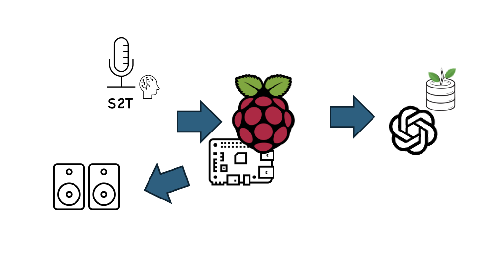
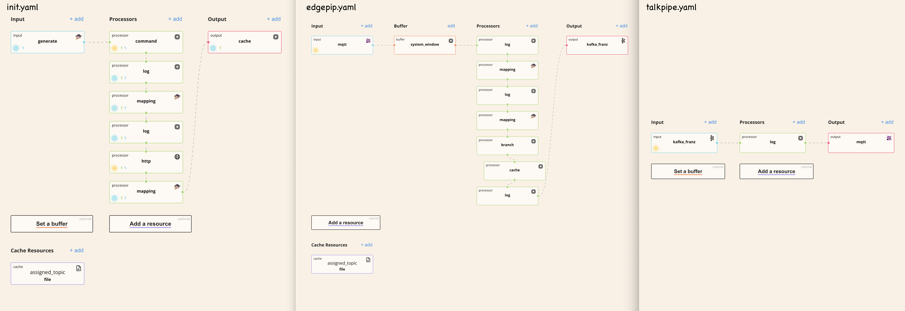
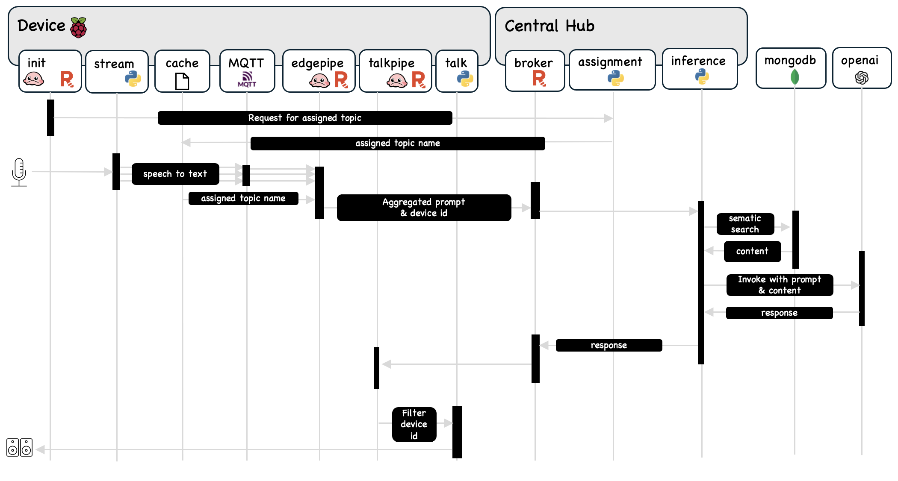

# Smart Robot Demo on Raspberry Pi 

## Introduction
This demo showcases a conversational robot built on a Raspberry Pi 4, transforming it into an interactive gadget capable of answering questions. The system leverages OpenAI for generating responses and utilizes Redpanda Connect for efficient data processing. The main inference work runs on a more powerful server, either local or cloud-based, while the Raspberry Pi handles real-time interaction with users. Despite its limited hardware resources, the edge device can efficiently manages speech-to-text conversion, communication with the central hub, and text-to-speech playback.

## High-Level Architecture

- Edge Device (Raspberry Pi 4)
    - **MQTT Server (Mosquitto)**: Manages communication between the microphone, the text-to-speech application, and the central hub.
    - **Stream Application (stream.py)**: Uses faster_whisper to transcribe speech into text, parses it into chunks, and sends them to the MQTT server.
    - **Talk Application (talk.py)**: Converts text back to speech and plays it through the speaker.
    - **Dynamic Topic Assignment (init.yaml)**: Uses Redpanda Connect, run when the edge device first boots, to get an assigned topic name for the device.
    - **Prompt Data Pipeline (edgepipe.yaml)**: Uses Redpanda Connect for lightweight, fast data transfer to the Redpanda Serverless Broker. It pre-processes and aggregates transcribed text chunks every 10 seconds, forming proper query sentences and sending them along with edge device info to the Redpanda Cluster.
    - **Response Data Pipeline (talkpipe.yaml)**: Uses Redpanda Connect to listen to the dynamically assigned topic, filters the answers that have the device ID, and sends them to the MQTT Server.

- Central Hub
  - **Redpanda Serverless Broker**: Acts as the central messaging system, facilitating communication between the edge device and the inference server. (We are using Redpanda Serverless in this case)
  - **Inference RAG Program (inference.py)**: Processes incoming queries using document search with a vector database and generates accurate answers by interfacing with OpenAI.
  - **Dynamic Topic Assignment (assignment.py)**: Assigns topics to edge devices based on load to manage the number of topics efficiently. (Since this is a demo, we are just hardcoding the topic name, but in the real world, you should have a strategy of grouping devices based on load and locations.)

## Technologies Used
  - `Raspberry Pi 4`: Low-cost, single-board computer serving as the edge device.
  - `MQTT Server (Mosquitto)`: Lightweight messaging protocol for small sensors and mobile devices, optimized for high-latency or unreliable networks.
  - `Faster Whisper`: A lightweight model for real-time speech-to-text conversion.
  - `Redpanda Connect`: Runs on the edge device to manage lightweight and fast data transfer, pre-processing, and aggregation of transcribed text.
  - `Redpanda Serverless` : Central messaging system enabling efficient communication between devices and servers.
  - `Mongo Atlas`: Document Search with Vector Database, used by the RAG program to provide contextually accurate answers.
  - `OpenAI` : Generates responses based on the context provided by the document search.

## Workflow

- Dynamic Topic Assignment: 
  - When the edge device starts up, it sends a request to an API endpoint `assignment.py`.
  - The API dynamically assigns a topic based on the current load and sends the topic name back to the edge device, where it is stored locally `init.yaml`.

- Speech to Text: 
  - The user speaks into the microphone.
  - The` stream.py` application transcribes speech to text and sends chunks to the MQTT server.
  - Redpanda Connect `edgepipe.yaml` on the edge device aggregates text chunks every 10 seconds to form a complete query. The query, along with edge device information, is sent to the Redpanda Cluster.

- Answer Generation:
  - The RAG program `inference.py` processes the query and generates an answer using document search with a vector database and invoke the OpenAI model.
  - The answer is sent to the dynamically assigned topic for the edge device.

- Text to Speech:
    - The edge device `talkpipe.yaml` listens to the assigned topic for the answer, filters the input data to match the device ID, and sends it to the MQTT broker.
    - The `talk.py` application converts the text answer to speech and plays it through the speaker.

export ASSIGNED_TOPIC=$(cat ./assigned_topic)
